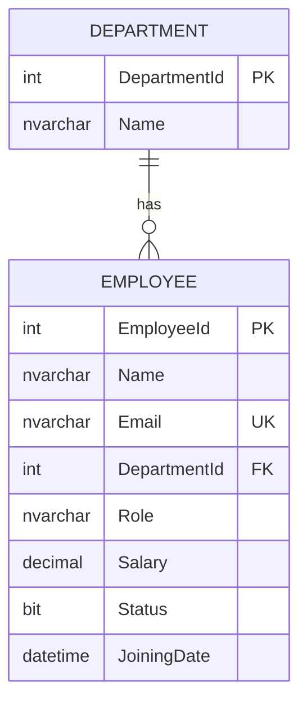

# 👥 Employee Management API

<div align="center">
  
  
  
  
  
  
  **A powerful and modern REST API for managing employees and departments built with ASP.NET Core**
  
  [🚀 Live Demo](https://your-api-domain.com) • [📖 API Documentation](https://your-api-domain.com/swagger) • [🐛 Report Bug](https://github.com/darshit-pp/employee-management-api/issues) • [✨ Request Feature](https://github.com/yourdarshit-pp/employee-management-api/issues)

</div>

---

## 📋 Table of Contents

- [✨ Features](#-features)
- [🏗️ Tech Stack](#️-tech-stack)
- [🚀 Quick Start](#-quick-start)
- [📡 API Endpoints](#-api-endpoints)
- [💾 Database Schema](#-database-schema)
- [🌐 Deployment](#-deployment)
- [📸 Screenshots](#-screenshots)
- [🧪 Testing](#-testing)
- [🤝 Contributing](#-contributing)
- [📄 License](#-license)

---

## ✨ Features

<table>
<tr>
<td>

🔧 **Core Features**
- ✅ Complete CRUD operations for Employees
- ✅ Department management with relationships
- ✅ RESTful API design principles
- ✅ Interactive Swagger UI documentation
- ✅ Entity Framework Core with Database First
- ✅ SQL Server database integration

</td>
<td>

🛡️ **Technical Features**
- ✅ Clean Architecture pattern
- ✅ Dependency Injection
- ✅ Data Transfer Objects (DTOs)
- ✅ Error handling and validation
- ✅ CORS enabled for global access
- ✅ Production-ready deployment

</td>
</tr>
</table>

---

## 🏗️ Tech Stack

<div align="center">

| Category | Technology |
|----------|------------|
| **Backend Framework** | ASP.NET Core 8.0 |
| **Database** | SQL Server / LocalDB |
| **ORM** | Entity Framework Core |
| **API Documentation** | Swagger/OpenAPI |
| **Architecture** | Clean Architecture |
| **Deployment** | Render / Azure / Railway |

</div>

---

## 🚀 Quick Start

### Prerequisites

- ✅ .NET 8.0 SDK
- ✅ SQL Server / SQL Server Express / LocalDB
- ✅ Visual Studio 2022 or VS Code
- ✅ Git

### Installation

1. **Clone the repository**
   ```bash
   git clone https://github.com/yourdarshit-pp/employee-management-api.git
   cd employee-management-api
   ```

2. **Install dependencies**
   ```bash
   dotnet restore
   ```

3. **Setup Database**
   ```sql
   -- Run in SQL Server Management Studio
   CREATE DATABASE EmployeeManagementDB;
   -- Then run the schema script from /Database/schema.sql
   ```

4. **Update Connection String**
 
   -- appsettings.json
   ```json
   {
     "ConnectionStrings": {
       "DefaultConnection": "Server=localhost;Database=EmployeeManagementDB;Trusted_Connection=true;TrustServerCertificate=true;"
     }
   }
   ```

6. **Run the application**
   ```bash
   dotnet run
   ```

7. **Open Swagger UI**
   ```
   https://localhost:7170
   ```

---

## 📡 API Endpoints

<details>
<summary><b>👥 Employee Endpoints</b></summary>

| Method | Endpoint | Description | Request Body |
|--------|----------|-------------|--------------|
| `GET` | `/api/employees` | Get all employees | - |
| `GET` | `/api/employees/{id}` | Get employee by ID | - |
| `POST` | `/api/employees` | Create new employee | [CreateEmployeeDto](#employee-dto) |
| `PUT` | `/api/employees/{id}` | Update employee | [UpdateEmployeeDto](#employee-dto) |
| `DELETE` | `/api/employees/{id}` | Delete employee | - |

</details>

<details>
<summary><b>🏢 Department Endpoints</b></summary>

| Method | Endpoint | Description | Request Body |
|--------|----------|-------------|--------------|
| `GET` | `/api/departments` | Get all departments | - |
| `GET` | `/api/departments/{id}` | Get department by ID | - |
| `POST` | `/api/departments` | Create new department | [CreateDepartmentDto](#department-dto) |
| `PUT` | `/api/departments/{id}` | Update department | [UpdateDepartmentDto](#department-dto) |
| `DELETE` | `/api/departments/{id}` | Delete department | - |

</details>

### Sample API Calls

<details>
<summary><b>📝 Create Employee</b></summary>

```bash
curl -X POST "https://your-api-domain.com/api/employees" \
  -H "Content-Type: application/json" \
  -d '{
    "name": "John Doe",
    "email": "john.doe@company.com",
    "departmentId": 1,
    "role": "Software Developer",
    "salary": 75000.00,
    "status": true,
    "joiningDate": "2024-01-15T00:00:00"
  }'
```

</details>

<details>
<summary><b>🏢 Create Department</b></summary>

```bash
curl -X POST "https://your-api-domain.com/api/departments" \
  -H "Content-Type: application/json" \
  -d '{
    "name": "Information Technology"
  }'
```

</details>

## 💾 Database Schema

<div align="center">



</div>

<details>
<summary><b> Database Queries </b></summary>
  
```sql
-- Create Database
CREATE DATABASE EmployeeManagementDB;
GO

USE EmployeeManagementDB;
GO

-- Create Department Table
CREATE TABLE Department (
    DepartmentId INT IDENTITY(1,1) PRIMARY KEY,
    Name NVARCHAR(100) NOT NULL
);
GO

-- Create Employee Table
CREATE TABLE Employee (
    EmployeeId INT IDENTITY(1,1) PRIMARY KEY,
    Name NVARCHAR(100) NOT NULL,
    Email NVARCHAR(100) NOT NULL UNIQUE,
    DepartmentId INT NOT NULL,
    Role NVARCHAR(50) NOT NULL,
    Salary DECIMAL(18,2) NOT NULL,
    Status BIT NOT NULL DEFAULT 1,
    JoiningDate DATETIME NOT NULL,
    FOREIGN KEY (DepartmentId) REFERENCES Department(DepartmentId)
);
GO

-- Insert Sample Data
INSERT INTO Department (Name) VALUES 
('Information Technology'),
('Human Resources'),
('Finance'),
('Marketing');
GO

INSERT INTO Employee (Name, Email, DepartmentId, Role, Salary, Status, JoiningDate) VALUES 
('John Doe', 'john.doe@company.com', 1, 'Software Developer', 75000.00, 1, '2023-01-15'),
('Jane Smith', 'jane.smith@company.com', 2, 'HR Manager', 65000.00, 1, '2022-03-20'),
('Mike Johnson', 'mike.johnson@company.com', 1, 'Senior Developer', 85000.00, 1, '2021-11-10'),
('Sarah Wilson', 'sarah.wilson@company.com', 3, 'Financial Analyst', 60000.00, 1, '2023-05-08');
GO
---
```
</details>

### Table Details

<details>
<summary><b>🏢 Department Table</b></summary>

| Column | Type | Constraints |
|--------|------|-------------|
| DepartmentId | INT | PRIMARY KEY, IDENTITY |
| Name | NVARCHAR(100) | NOT NULL |

</details>

<details>
<summary><b>👤 Employee Table</b></summary>

| Column | Type | Constraints |
|--------|------|-------------|
| EmployeeId | INT | PRIMARY KEY, IDENTITY |
| Name | NVARCHAR(100) | NOT NULL |
| Email | NVARCHAR(100) | NOT NULL, UNIQUE |
| DepartmentId | INT | FOREIGN KEY |
| Role | NVARCHAR(50) | NOT NULL |
| Salary | DECIMAL(18,2) | NOT NULL |
| Status | BIT | DEFAULT 1 |
| JoiningDate | DATETIME | NOT NULL |

</details>

## 🧪 Testing

### Run Tests
```bash
# Unit tests
dotnet test

# API tests with specific endpoint
curl -X GET "https://localhost:7170/api/employees" -H "accept: application/json"
```

### Test Data
The API comes with sample data:
- 4 Departments (IT, HR, Finance, Marketing)
- 4 Sample Employees across different departments

---

## 📁 Project Structure

```
EmployeeManagementAPI/
├── 📁 Controllers/          # API Controllers
│   ├── EmployeesController.cs
│   └── DepartmentsController.cs
├── 📁 Data/                 # Database Context
│   └── EmployeeManagementContext.cs
├── 📁 Models/               # Entity Models
│   ├── Employee.cs
│   └── Department.cs
├── 📁 Services/             # Business Logic
│   ├── IEmployeeService.cs
│   ├── EmployeeService.cs
│   ├── IDepartmentService.cs
│   └── DepartmentService.cs
├── 📁 DTOs/                 # Data Transfer Objects
│   ├── EmployeeDto.cs
│   └── DepartmentDto.cs
├── 📄 Program.cs            # Application Entry Point
├── 📄 appsettings.json      # Configuration
└── 📄 README.md             # This file
```

---

## 🤝 Contributing

We love contributions! Here's how you can help:

<details>
<summary><b>🛠️ Development Setup</b></summary>

1. Fork the project
2. Create your feature branch (`git checkout -b feature/amazing-feature`)
3. Commit your changes (`git commit -m 'Add some amazing feature'`)
4. Push to the branch (`git push origin feature/amazing-feature`)
5. Open a Pull Request

</details>

### 🐛 Found a Bug?

1. Check if it's already reported in [Issues](https://github.com/darshit-pp/employee-management-api/issues)
2. If not, create a new issue with:
   - Clear description
   - Steps to reproduce
   - Expected vs actual behavior
   - Screenshots (if applicable)

### 💡 Feature Requests

We're always looking to improve! Open an issue with:
- Clear description of the feature
- Use case explanation
- Any relevant examples

---

## 📈 Roadmap

- [ ] 🔐 JWT Authentication & Authorization
- [ ] 📊 Dashboard Analytics APIs
- [ ] 📧 Email Notifications
- [ ] 📱 Mobile App Support
- [ ] 🔍 Advanced Search & Filtering
- [ ] 📄 PDF Report Generation
- [ ] 🔄 API Versioning
- [ ] 📝 Audit Logging

---

## 📄 License

This project is licensed under the MIT License - see the [LICENSE](LICENSE) file for details.

```
MIT License

Copyright (c) 2024 Your Name

Permission is hereby granted, free of charge, to any person obtaining a copy
of this software and associated documentation files (the "Software"), to deal
in the Software without restriction...
```

---
